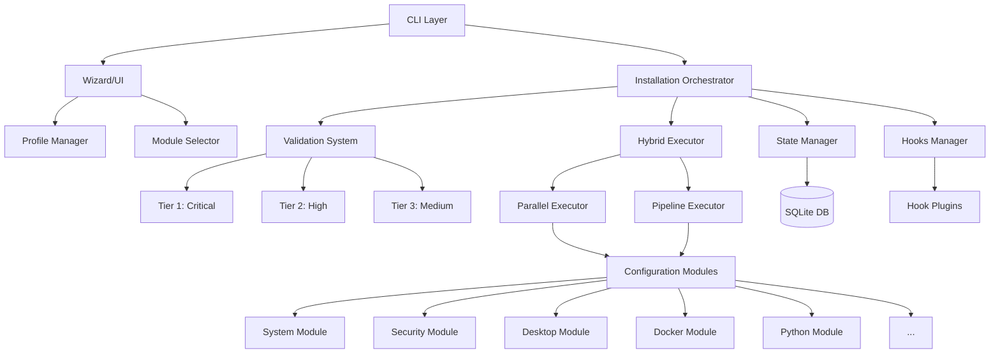
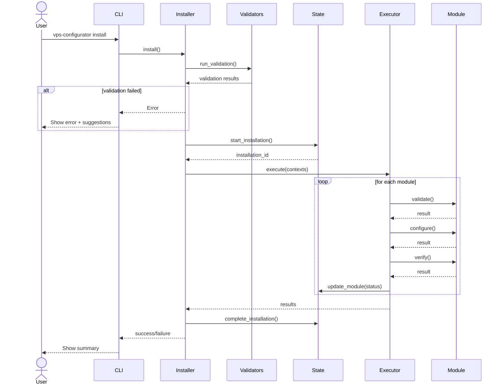
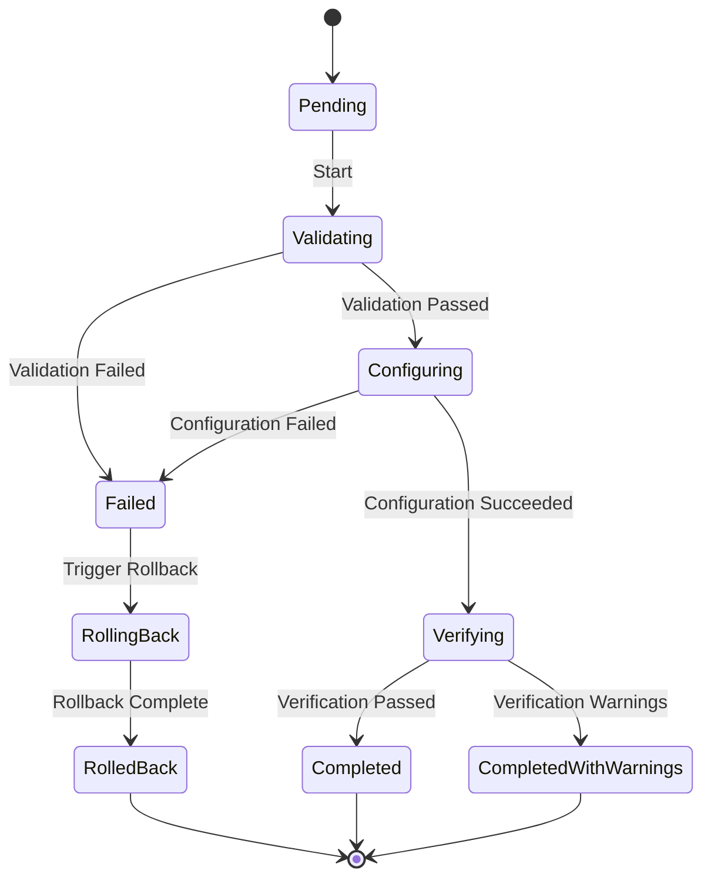

# System Architecture

This document describes the architecture of the Debian VPS Workstation Configurator.

## Overview

The system follows a **modular plugin architecture** with **layered components** and **event-driven hooks**.



## Architecture Layers

### 1. Presentation Layer

**Components:**

- `cli.py` - Click-based CLI
- `wizard/*` - Textual TUI
- `ui/prompts/*` - Interactive prompts
- `ui/formatters/*` - Output formatting

**Responsibilities:**

- User input collection
- Output display
- Progress reporting
- Error presentation

### 2. Application Layer

**Components:**

- `core/installer.py` - Orchestration
- `profiles/manager.py` - Profile management
- `core/hooks/manager.py` - Event coordination

**Responsibilities:**

- Business logic
- Workflow orchestration
- Profile handling
- Event triggering

### 3. Execution Layer

**Components:**

- `core/execution/hybrid.py` - Execution router
- `core/execution/parallel.py` - Parallel execution
- `core/execution/pipeline.py` - Sequential execution

**Responsibilities:**

- Module execution
- Dependency resolution
- Parallel optimization
- Error handling

### 4. Module Layer

**Components:**

- `modules/base.py` - Base module class
- `modules/system.py` - System configuration
- `modules/docker.py` - Docker setup
- `modules/*` - 20+ modules

**Responsibilities:**

- Package installation
- Configuration
- Service management
- Verification

### 5. Infrastructure Layer

**Components:**

- `validators/*` - Validation system
- `core/state/*` - State persistence
- `dependencies/*` - Dependency tracking
- `utils/*` - Utilities

**Responsibilities:**

- System validation
- State persistence
- Dependency management
- Cross-cutting concerns

## Data Flow

### Installation Flow



### Module Lifecycle



## Component Details

### Installer (Orchestrator)

**Purpose:** Central coordinator for installation process.

**Key Methods:**

```python
class Installer:
    def install(self, skip_validation=False, dry_run=False, parallel=True):
        # 1. Validate system prerequisites
        # 2. Check for resume
        # 3. Start installation state
        # 4. Execute pre-installation hooks
        # 5. Create execution contexts
        # 6. Execute modules via hybrid executor
        # 7. Execute post-installation hooks
        # 8. Complete state
        # 9. Show summary
```

**Dependencies:**

- ValidationOrchestrator (Sprint 1)
- StateManager (Sprint 1)
- HybridExecutor (Sprint 2)
- HooksManager (Sprint 2)
- ProfileManager (Sprint 3)

### Hybrid Executor

**Purpose:** Intelligently route modules to optimal execution strategy.

**Routing Logic:**

```python
def _should_use_pipeline(module):
    return (
        module.force_sequential or
        module.large_module or
        len(contexts) == 1
    )
```

**Execution Strategies:**

1. **ParallelExecutor:**

   - Uses ThreadPoolExecutor
   - Executes independent modules concurrently
   - Speedup: 4-5x vs sequential

2. **PipelineExecutor:**
   - Generator-based streaming
   - For large sequential modules
   - Memory efficient

### State Manager

**Purpose:** Persist installation state for resume capability.

**Schema:**

```sql
CREATE TABLE installations (
    installation_id TEXT PRIMARY KEY,
    started_at TEXT,
    completed_at TEXT,
    profile TEXT,
    overall_status TEXT
);

CREATE TABLE modules (
    installation_id TEXT,
    module_name TEXT,
    status TEXT,
    progress_percent INTEGER,
    error_message TEXT
);
```

**Features:**

- Resume after crash
- Checkpoint/restore
- Audit trail
- Performance analytics

### Hooks System

**Purpose:** Allow custom actions at lifecycle events.

**Hook Events:**

```python
class HookEvent(Enum):
    BEFORE_INSTALLATION = "before_installation"
    AFTER_MODULE_CONFIGURE = "after_module_configure"
    ON_MODULE_ERROR = "on_module_error"
    # ... 15+ events
```

**Usage:**

```python
@hook(HookEvent.AFTER_MODULE_CONFIGURE, priority=HookPriority.HIGH)
def send_notification(context):
    slack.send(f"Module {context.module_name} completed")
```

## Extension Points

The system is designed to be extensible:

### 1. Custom Modules

Create new configuration modules:

```python
from configurator.modules.base import ConfigurationModule
from configurator.dependencies.decorators import module

@module(
    name="mymodule",
    priority=50,
    depends_on=["system"]
)
class MyModule(ConfigurationModule):
    def validate(self) -> bool:
        # Check prerequisites
        pass

    def configure(self) -> bool:
        # Install and configure
        pass

    def verify(self) -> bool:
        # Verify installation
        pass
```

### 2. Custom Validators

Add custom validation checks:

```python
from configurator.validators.base import BaseValidator

class CustomValidator(BaseValidator):
    severity = ValidationSeverity.HIGH

    def validate(self) -> ValidationResult:
        # Perform validation
        pass
```

### 3. Hook Plugins

Add event handlers:

```python
# configurator/core/hooks/plugins/my_plugin.py
from configurator.core.hooks.decorators import hook

@hook(HookEvent.AFTER_MODULE_CONFIGURE)
def my_handler(context):
    # Handle event
    pass
```

### 4. Custom Profiles

Create profile templates:

```yaml
# ~/.config/debian-vps-configurator/profiles/my-profile.yaml
name: my-profile
enabled_modules:
  - system
  - security
  - custom-module
```

## Design Patterns

### Used Patterns

1. **Plugin Architecture** - Modules are plugins
2. **Dependency Injection** - Container pattern
3. **Strategy** - Execution strategies (parallel/pipeline)
4. **Observer** - Hooks/events
5. **Factory** - Module instantiation
6. **Circuit Breaker** - Network resilience
7. **State** - Installation state machine
8. **Chain of Responsibility** - Validators

### SOLID Principles

- **S**ingle Responsibility: Each module handles one concern
- **O**pen/Closed: Extensible via plugins
- **L**iskov Substitution: All modules implement same interface
- **I**nterface Segregation: Small, focused interfaces
- **D**ependency Inversion: Depend on abstractions

## Performance Considerations

### Optimizations

1. **Parallel Execution:**

   - 4-5x speedup for independent modules
   - Configurable worker count

2. **Lazy Loading:**

   - 12x faster CLI startup
   - Modules loaded on-demand

3. **Package Caching:**

   - 50-90% bandwidth savings
   - Reuse downloaded packages

4. **Circuit Breaker:**
   - Prevent cascade failures
   - Exponential backoff

### Resource Usage

| Resource | Typical    | Peak                      |
| -------- | ---------- | ------------------------- |
| RAM      | 100-200 MB | 500 MB                    |
| CPU      | 20-40%     | 80%                       |
| Disk I/O | Moderate   | High (during apt install) |
| Network  | 5-20 MB/s  | 50 MB/s                   |

## Security Architecture

### Defense in Depth

1. **Input Validation:**

   - All user input validated
   - Dangerous characters blocked
   - Type checking

2. **Least Privilege:**

   - RBAC for user permissions
   - Minimal sudo rules

3. **Supply Chain:**

   - Package signature verification
   - SHA256 checksums
   - Trusted repositories only

4. **Network:**
   - UFW firewall
   - Fail2ban protection
   - SSH key authentication

## Testing Strategy

### Test Pyramid

```
        /\
       /E2E\\        ← 10 tests (full workflows)
      /------\\
     /  Intg  \\     ← 50 tests (component interaction)
    /----------\\
   /    Unit    \\   ← 300+ tests (individual units)
  /--------------\\
```

**Coverage Targets:**

- Unit: ≥90%
- Integration: ≥80%
- E2E: Critical paths
- Overall: ≥85%

## Future Architecture

### Planned Enhancements

1. **Microservices:**

   - Split into API + worker services
   - REST API for remote management

2. **Event Sourcing:**

   - Full audit trail
   - Replay installation

3. **Distributed Execution:**

   - Execute across multiple nodes
   - Load balancing

4. **Plugin Marketplace:**
   - Community modules
   - Version management

---

**See Also:**

- [Module Development](module-development.md)
- [Contributing](contributing.md)
- [API Reference](../api-reference/index.md)
